 <h2 align="center">EMILIO LOPEZ LEON</h2>
 <h2 align="center">PRUEBA TECNICA</h2>
## DOCUMENTACION

Este proyecto tiene como objetivo crear una aplicación web de gestión de tareas, permitiendo gestionar proyectos, asignar tareas a usuarios, registrar tiempos y generar informes en formato PDF.

📌1-Instrucciones de instalación y configuración <br>
📌2-Explicación de la estructura del código <br>
📌3-Breve manual de uso <br>
📌4-Información sobre el servidor web y entornos usados

Proyecto desarrollado en Laravel 10 con Bootstrap 4 y AdminLTE 3, utilizando AJAX para gestión de usuarios y proyectos, FullCalendar para tareas y DomPDF para generación de informes.

## 📌 Requisitos

- Laravel.
- PHP 8 o superior.
- Composer.
- MySQL.
- Node.js y NPM.

## 1-Instrucciones de instalación y configuración

1. Clonar el repositorio:<br>
   ```
   git clone https://github.com/tu-usuario/prueba-simj.git
   cd prueba-simj
   ```
2. Instalar dependencias:<br>
	```composer install <br>
	npm install```
3. Configurar entorno:<br>
	```cp .env.example .env```
4. Generar clave y ejecutar migraciones:<br>
	```
	php artisan key:generate
	php artisan migrate
	```
5. Compilar assets:<br>
	```npm run dev```
6. Iniciar el servidor:<br>
	```php artisan serve```

## 2-Explicación de la estructura del código

- app/Http/Controllers → Controladores de usuarios, proyectos, tareas y informes.
- app/Models → Modelos de base de datos.
- database/migrations → Migraciones de la base de datos.
- resources/views → Vistas Blade con AdminLTE.
- public/ → Archivos estáticos de AdminLTE y FullCalendar.

## 3-Breve manual de uso

- Registrarse en el sistema.<br>
Si es la primera vez que usas la aplicación, crea una cuenta de usuario desde la página de inicio.
- Autenticarse en el sistema:<br>
Desde la pagina de inicio, iniciar sesion.
- Crear proyectos y asignarles tareas arrastrándolos al calendario:<br>
Una vez dentro, los administradores pueden crear nuevos proyectos desde el boton de '+'.<br>
Cada proyecto puede tener múltiples tareas que se asignan arrastrandolas al calendario.
- Generar informes en PDF:<br>
Para generar un pdf, presionar el boton de pdf y selecciona el rango de fechas, el proyecto y el usuario. Luego haz clic en 'Generar Informe' y podrás descargar el PDF generado.


## 4-Información sobre el servidor web y entornos usados

- Caracteristicas servidor Web:<br>
-Servidor web: Apache.<br>
-PHP: Versión 8.1<br>
-Base de datos: MySQL.<br>
-Entorno de desarrollo: XAMPP (en local)<br>
- Framework: Laravel 12.
- Frontend: Bootstrap, AdminLTE, FullCalendar.

## 5-Demostraciones

- Pagina para acceder a la aplicacion:<br>
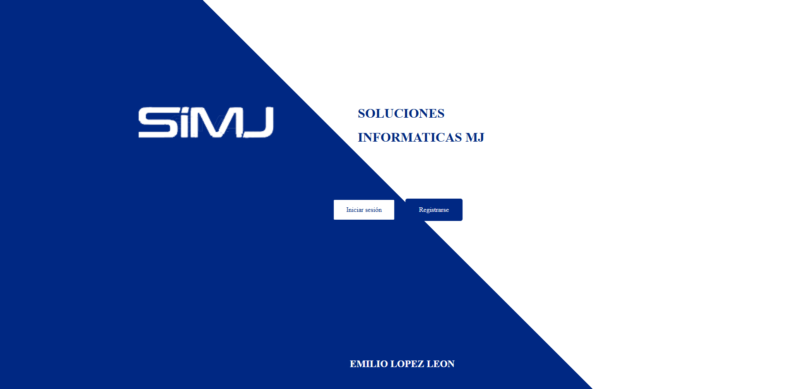
- Pagina de registro:<br>
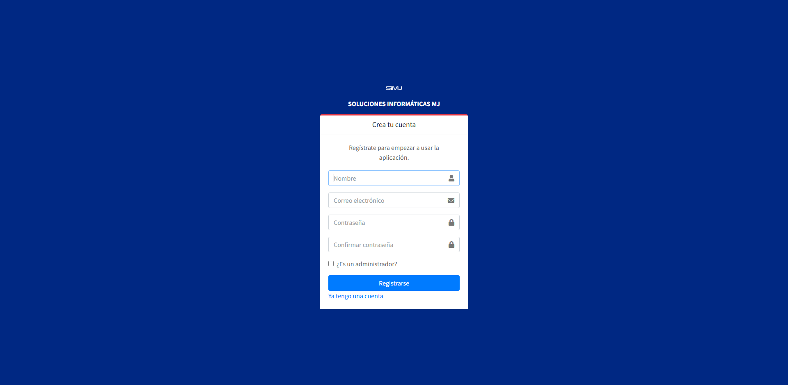
- Pagina de login:<br>
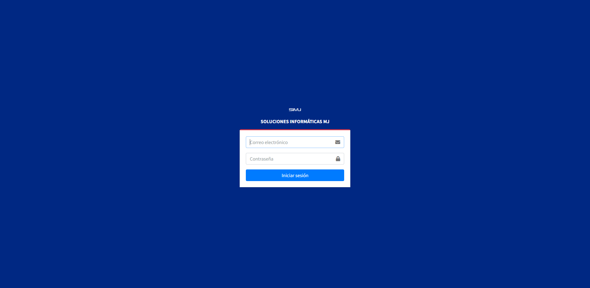
- Documentación gráfica sobre interfaz administrador y funciones:<br>
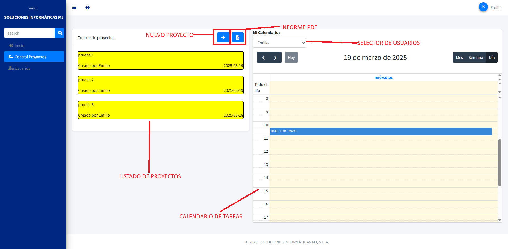
- Documentación gráfica sobre interfaz SIN SER ADMINISTRADOR (El boton para crear proyecto no esta):<br>
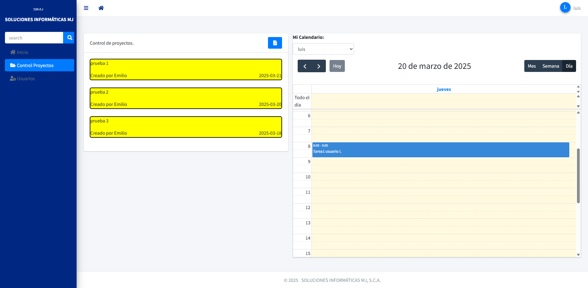
- Se debe poder arrastrar la tarjeta del proyecto sobre el calendario.<br>
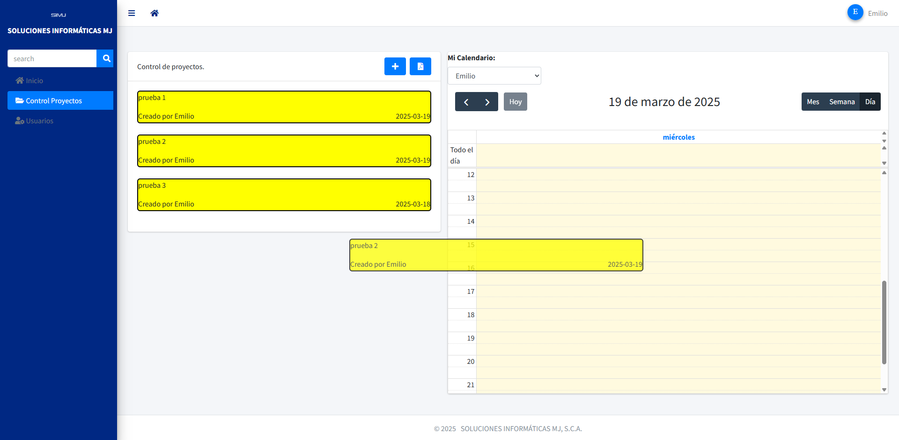
- lo que abrirá una ventana emergente con la información de la tarea a rellenar (Manteniendo la fecha y hora de inicio a la que se arrastró la tarjeta):
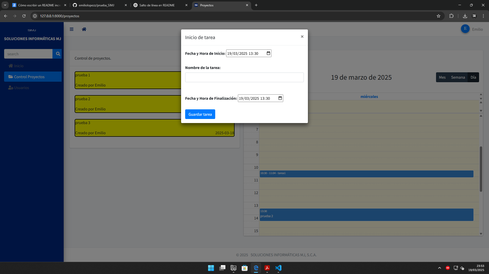
- Deberán aparecer cargados todos los eventos guardados en el calendario de cada usuario:
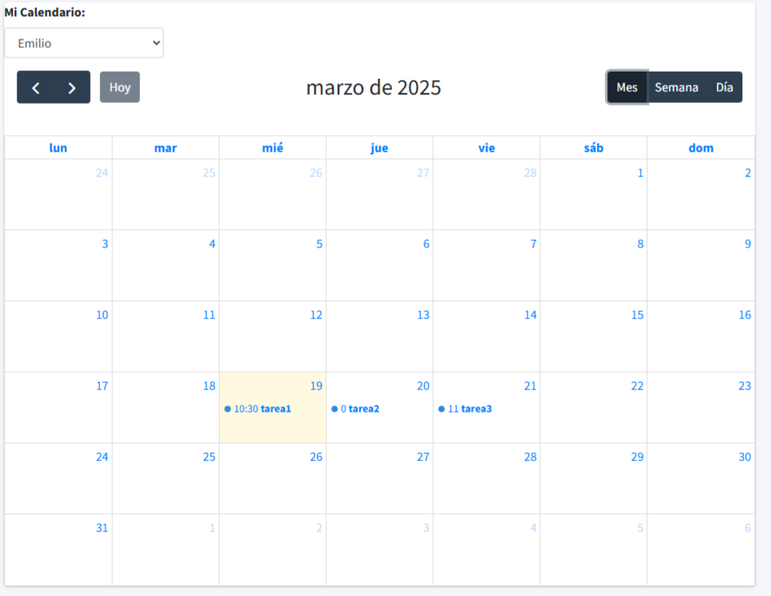
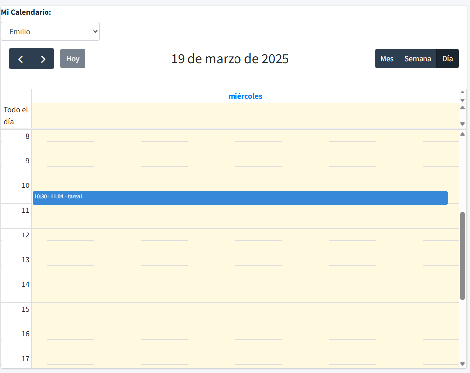
- El informe PDF deberá tener las siguientes opciones para filtrar: <br>
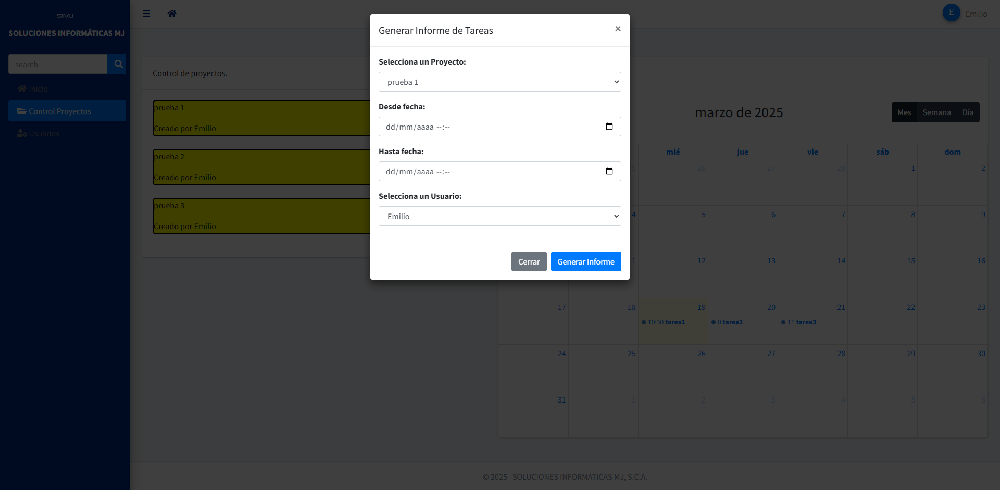
- Diseño del informe:<br>
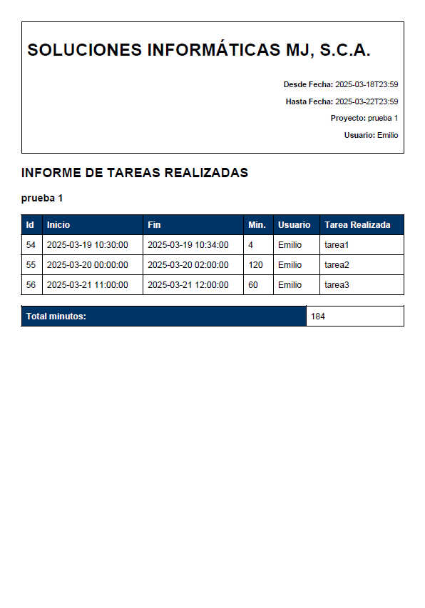